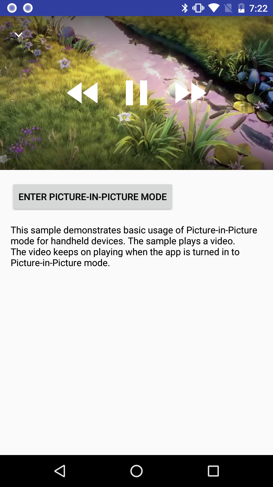

Android PictureInPicture Sample (Kotlin)
===================================

This sample demonstrates basic usage of Picture-in-Picture mode for handheld devices.
The sample plays a video. The video keeps on playing when the app is turned in to
Picture-in-Picture mode. On Picture-in-Picture screen, the app shows an action item to
pause or resume the video.

Introduction
------------

As of Android O, activities can launch in [Picture-in-Picture (PiP)][1] mode. PiP is a
special type of [multi-window][2] mode mostly used for video playback.

The app is *paused* when it enters PiP mode, but it should continue showing content. For this
reason, you should make sure your app does not pause playback in its [onPause()][3]
handler. Instead, you should pause video in [onStop()][4]. For more information, see [Multi-Window
Lifecycle][5].

To specify that your activity can use PIP mode, set `android:supportsPictureInPicture` to `true` in
the manifest. (Beginning with the O Developer Preview, you do not need to set
`android:resizeableActivity` to `true` if you are supporting PIP mode, either on Android TV or on
other Android devices; you only need to `setrandroid:resizeableActivity` if your activity supports
other multi-window modes.)

You can pass a [PictureInPictureParams][6] to [enterPictureInPictureMode()][7] to specify how an
activity should behave when it is in PiP mode. You can also use it to call
[setPictureInPictureParams()][8] and update the current behavior. If the app is in not PiP mode, it
will be used for later call of [enterPictureInPictureMode()][7].

With a [PictureInPictureParams][6], you can specify aspect ratio of PiP activity and action items
available for PiP mode. The aspect ratio is used when the activity is in PiP mode. The action items
are used as menu items in PiP mode. You can use a [PendingIntent][9] to specify what to do when the
item is selected.

[1]: https://developer.android.com/guide/topics/ui/multi-window.html
[2]: https://developer.android.com/guide/topics/ui/picture-in-picture.html
[3]: https://developer.android.com/reference/android/app/Activity.html#onPause()
[4]: https://developer.android.com/reference/android/app/Activity.html#onStop()
[5]: https://developer.android.com/guide/topics/ui/multi-window.html#lifecycle
[6]: https://developer.android.com/reference/android/app/PictureInPictureParams.html
[7]: https://developer.android.com/reference/android/app/Activity.html#enterPictureInPictureMode(android.app.PictureInPictureParams)
[8]: https://developer.android.com/reference/android/app/Activity.html#setPictureInPictureParams(android.app.PictureInPictureParams)
[9]: https://developer.android.com/reference/android/app/PendingIntent.html

Pre-requisites
--------------

- Android SDK 26
- Android Build Tools v26.0.2
- Android Support Repository

Screenshots
-------------

  

Getting Started
---------------

This sample uses the Gradle build system. To build this project, use the
"gradlew build" command or use "Import Project" in Android Studio.

Support
-------

- Google+ Community: https://plus.google.com/communities/105153134372062985968
- Stack Overflow: http://stackoverflow.com/questions/tagged/android

If you've found an error in this sample, please file an issue:
https://github.com/googlesamples/android-PictureInPicture

Patches are encouraged, and may be submitted by forking this project and
submitting a pull request through GitHub. Please see CONTRIBUTING.md for more details.

License
-------

Copyright 2017 The Android Open Source Project, Inc.

Licensed to the Apache Software Foundation (ASF) under one or more contributor
license agreements.  See the NOTICE file distributed with this work for
additional information regarding copyright ownership.  The ASF licenses this
file to you under the Apache License, Version 2.0 (the "License"); you may not
use this file except in compliance with the License.  You may obtain a copy of
the License at

http://www.apache.org/licenses/LICENSE-2.0

Unless required by applicable law or agreed to in writing, software
distributed under the License is distributed on an "AS IS" BASIS, WITHOUT
WARRANTIES OR CONDITIONS OF ANY KIND, either express or implied.  See the
License for the specific language governing permissions and limitations under
the License.
